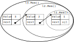

# Predicates as termination measures

Predicate instances can be used as [termination measures](../01/termination.md).
The measure decreases if an instance is nested within another predicate instance.
For example, `l1.Mem()` is nested within `l2.Mem()` and `l2.Mem()` is nested within `l3.Mem()`.
``` go
l1 := New(1, Empty())
// @ fold l1.Mem()
l2 := New(2, l1)
// @ fold l2.Mem()
l3 := New(3, l2)
// @ fold l3.Mem()
```



The termination measure is lower bounded for predicate instances with a finite unfolding [^1].
For example, `l3.Mem()` has two predicate instances nested within, whereas `l1.Mem()` has no other predicate instance nested within.


To prove termination of the `List` method `Length`, we add the termination measure `l.Mem()`.
As is common for recursive functions, we unfold the predicate instance before the recursive call.
It is decreasing since `l.next.Mem()` is nested within `l.Mem()`.
``` go
{{#include list.go:length}}
```
Please note that we write `decreases l.Mem()` instead of `decreases acc(l.Mem(), 1/2)`, even if we only require `acc(l.Mem(), 1/2)`.
<!-- Logic error: got unexpected type assertion -->

For the `List` API, we can use the termination measure `l.Mem()` for the methods `Length` , `Get`, `View`.

It might be tempting to use the length of a `List` or the length of the sequence from the abstraction function `View` as an integer termination measure.
For this, the function must be `pure`, which requires a termination measure in turn.

We chose a recursive implementation for `Length`, in order to preserve access to `l.Mem()`.
An idiomatic iterative implementation is more challenging to verify.
When iteratively iterating over a list, we keep unfolding `current.Mem()` and lose access to the already visited elements.
It is not directly clear how one could fold the predicate instances back such that `l.Mem()` is preserved by `LengthIterative`.
A common approach is to define a predicate that denotes access to a segment of a list instead of the entire tail.
Alternatively, [magic wands](./magic-wands.md) are applicable in this situation.
``` go
{{#include list.go:LengthIterative}}
```


<!-- [viper tutorial](https://viper.ethz.ch/tutorial/#termination-measures-and-decreases-clauses) -->
<!-- PredicateInstance -->
<!-- (predicate_instance.vpr) 	p1 <_ p2 <==> nested(p1, p2) -->

<!--
- iterative length / or getting last element
  - seen how to write a (recursive) function to get the length of a linked list
  - this function preserved access to the linked list
  - if we write an iterative version
  - traversing the list we must unfold access
  - it is not clear how we could fold it back to return back the full permission to the list
  - this can be achieved by using _magic wands_ , an advanced topic (link)
  - Example: iterative length without ensures Mem ... -->


[^1]: Technically, a predicate instance with no finite unfolding is still accepted as a termination measure by Gobra.
For example, the recursive predicate `stream` represents access to an infinite list, and a predicate instance `stream(l)` has no finite unfolding.
Nevertheless, it can be used as a termination measure, with the unexpected behavior that we can prove that `streaming` terminates.
<!-- One cannot obtain `stream(l)` without already holding such a predicate instance. -->
<!-- Such an instance cannot be obtained in practice and the function `streaming` with precondition `stream(l)` not called. -->
``` go
{{#include list.go:stream}}
```
