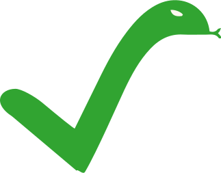

# Overview

🚧 This book is under construction. It is very incomplete at the moment and it is likely to change significantly. 🚧

This book is an online resource that teaches how to prove the correctness of your programs written in Go against a formal specification.
We use the [Gobra](https://www.pm.inf.ethz.ch/research/gobra.html) verifier, and we exemplify it on multiple examples and exercises.

- If you find errors or have suggestions, please file an issue [here](https://github.com/viperproject/gobra-book/issues).
- If you have any questions about Gobra's features that are not yet addressed in the book, feel free to ask them on [Zulip](https://gobra.zulipchat.com/).
- Finally, if you are interested in contributing directly to the project, please refer to our [guide for contributors](https://github.com/viperproject/gobra-book/blob/main/CONTRIBUTING.md).

Some code blocks are tagged with the following images, to make it clear which code contains errors or verifies:
|                                                                                    |                                   |
|:----------------------------------------------------------------------------------:|:---------------------------------:|
|  | Go program does not compile       |
|            | Program panics                    |
|                  | Verified by Gobra                 |
|    | Gobra does not verify the program |
